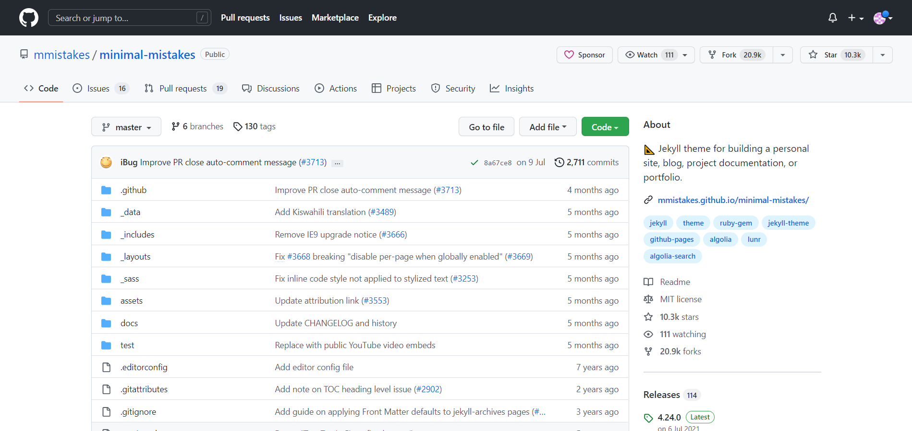
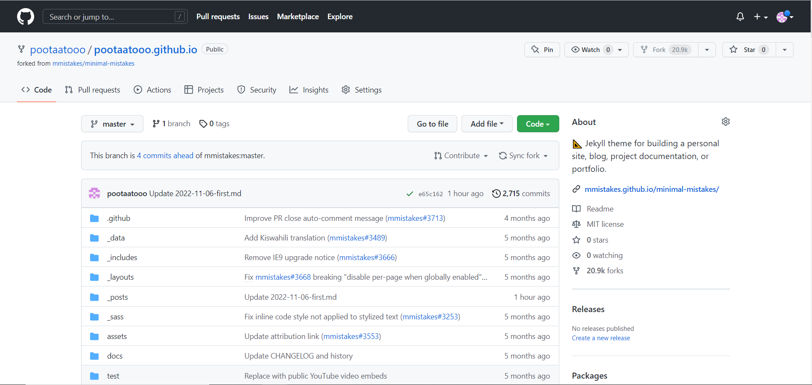
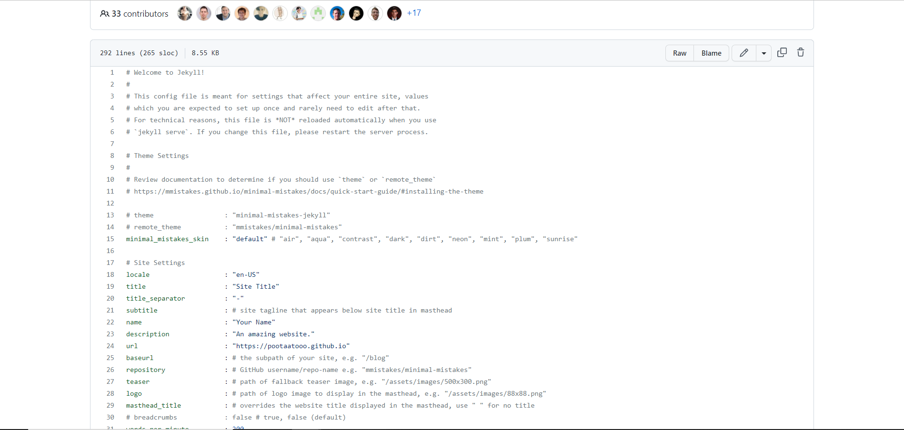
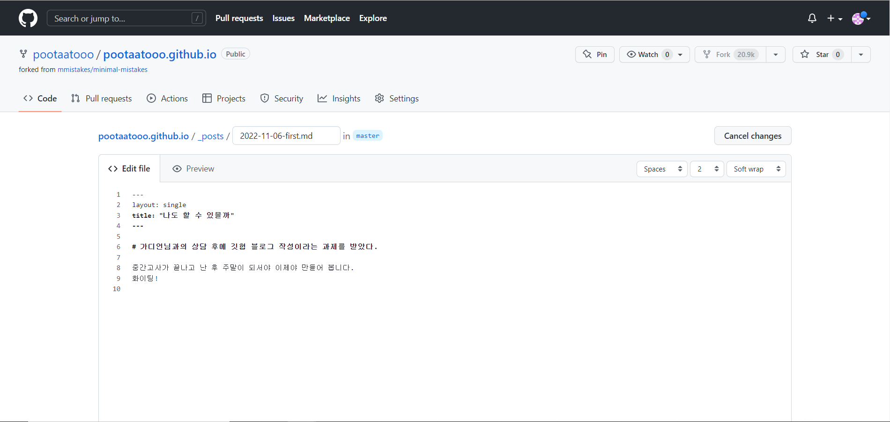

# 이미지를 넣어봅시다.

왜 안되니

이제 되는구만 

블로그를 어떻게 만들었는지 써보려고 한다.

일단 처음으로 [jekyll-theme · GitHub Topics](https://github.com/topics/jekyll-theme)에 들어가서 가장 위에 있는 테마인 minimal-mistakes 테마를 다운 받은 후(star가 높을 수록 인기가 많은 거란다.) 

좌측 상단에 내 Github이름으로 변경해준다.

24번 줄에 URL주소를 알맞은 양식으로 변경한다.

마크다운 파일을 하나 생성해주고 아래 양식에 맞게 블로그를 썼다 !

오늘 낮 부터 이거 한다고 수업시간 틈틈히 계속 봤는데 응컴 점수는 망했고 이미지도 안 되는 줄 알았는데 이거는 결국 되는구만

화이팅 ..
